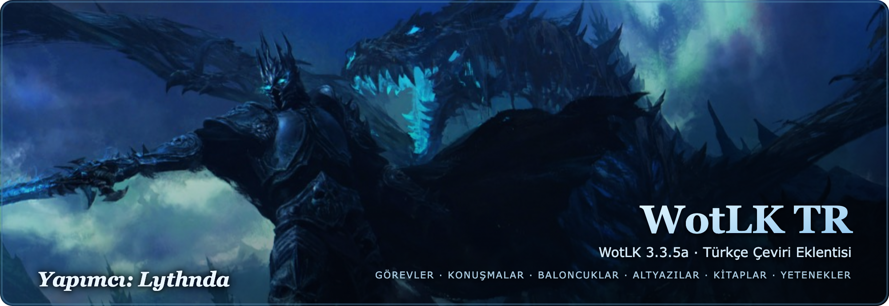
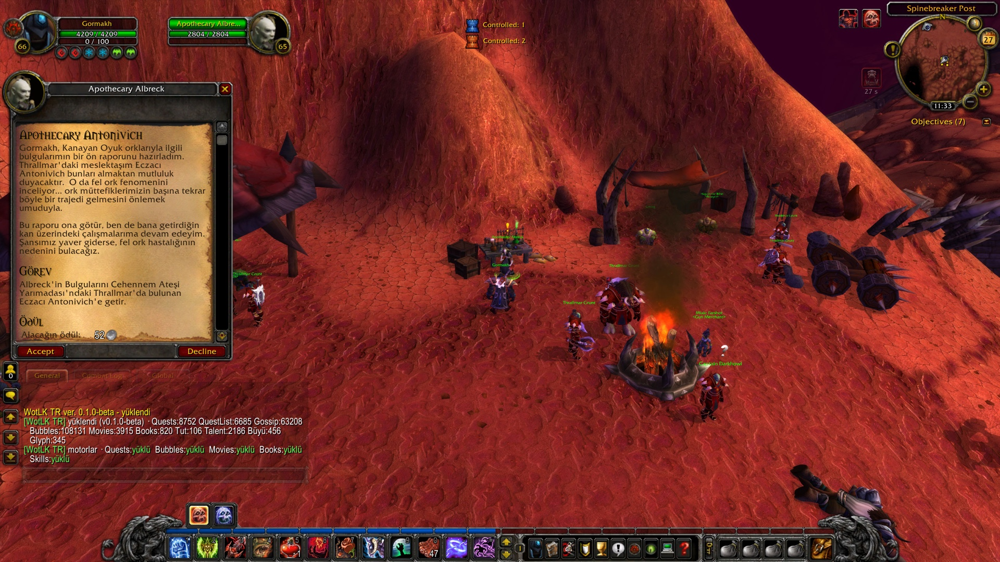
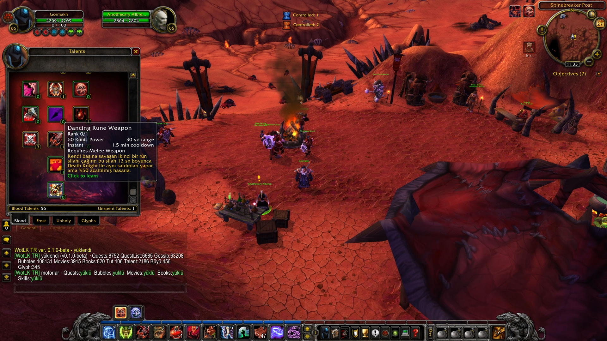
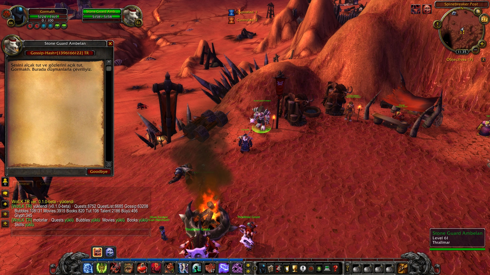
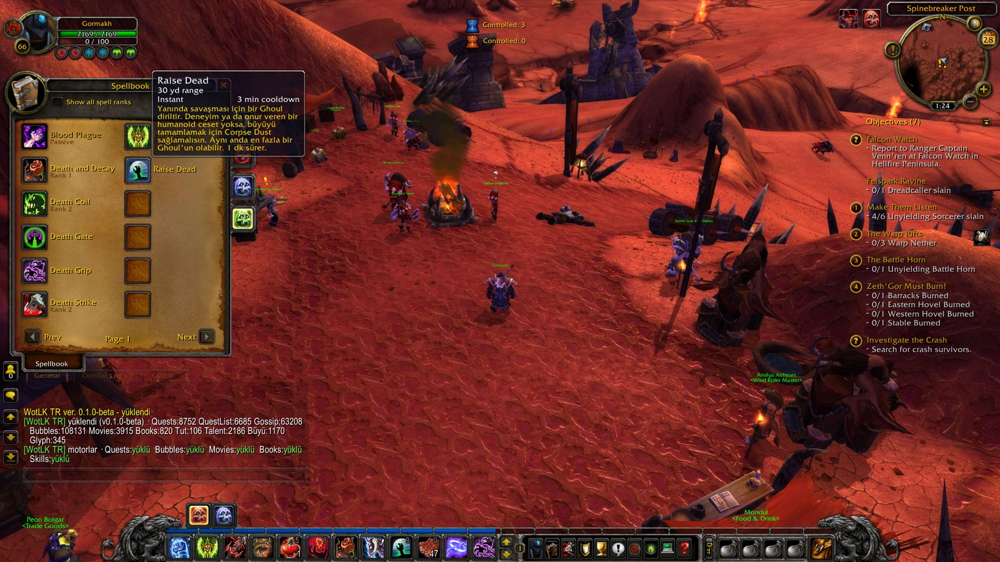

<div align="center">



[](https://github.com/ekremcanaltunyurt/WOTLKTR/releases)
&nbsp;
&nbsp;
&nbsp;
&nbsp;[](https://github.com/ekremcanaltunyurt/WOTLKTR/releases)

**World of Warcraft: Wrath of the Lich King (3.3.5a)** için Türkçe çeviri eklentisi.
Görevleri, NPC konuşmalarını, kitapları ve daha fazlasını **anında Türkçe** okursun.

</div>

---

> ⚠️ **Beta · `v0.1.0-beta`.** Geliştirme sürüyor; eksik veya hatalı çeviriler olabilir, geri bildirime açıktır. Tüm değişiklikler: [CHANGELOG](CHANGELOG.md).

## ✨ Neleri çevirir?

| Modül | Kapsam |
|-------|--------|
| 📜 **Görevler** | Başlık, açıklama, hedefler, ödüller |
| 💬 **NPC Konuşmaları (Gossip)** | Diyalog seçenekleri ve metinleri |
| 🗨️ **Konuşma Baloncukları** | NPC baş üstü baloncukları, say ve yell metinleri |
| 🎬 **Sinematik Altyazılar** | Açılış filmi ve ara sahne (cinematic) altyazıları |
| 📖 **Kitaplar** | Oyun içi kitap, mektup ve tomarlar (EN/TR geçişli) |
| 💡 **İpuçları (Tutorials)** | Oyun öğretici pencereleri |
| 🪄 **Yetenekler** | Talent, büyü ve glyph tooltip açıklamaları |

## 📸 Önizleme

<div align="center">

| 📜 Görev çevirisi | 🪄 Yetenek (talent) çevirisi |
|:---:|:---:|
|  |  |
| 💬 NPC konuşması (gossip) | ✨ Büyü (spell) çevirisi |
|  |  |

<sub>Oyun içi · WotLK 3.3.5a (Warmane)</sub>

</div>

## 📥 Kurulum

> 🎮 **Gereksinim:** WotLK **3.3.5a (build 12340)** istemcisi. Warmane dahil tüm 3.3.5a sunucularıyla uyumludur.

**Yöntem 1: Hazır paket (önerilen)**

1. [**Releases**](https://github.com/ekremcanaltunyurt/WOTLKTR/releases) sayfasından `WOTLKTR-v0.1.0-beta.zip` dosyasını indir.
2. Zip'i aç; içindeki **`WOTLKTR`** klasörünü şu konuma kopyala:
   `World of Warcraft\Interface\AddOns\`
3. Oyunu başlat. Karakter seçim ekranındaki **AddOns** listesinde görünür.

**Yöntem 2: Depoyu klonla**

```bash
git clone https://github.com/ekremcanaltunyurt/WOTLKTR.git
```

> ℹ️ Klasör adı tam olarak **`WOTLKTR`** olmalı; eklenti buna bağlıdır.
> Doğru kurulduysa şu dosya oluşur: `…\Interface\AddOns\WOTLKTR\WOTLKTR.toc`
> (`WOTLKTR\WOTLKTR\…` gibi iç içe çift klasör **olmamalı**.)

## ⚙️ Kullanım

Eklenti otomatik yüklenir. Girişte sohbette bir **yükleme özeti** çıkar (her modülün çeviri sayısı +
motor durumu). Bir şey yüklenmezse kırmızı **`YOK`** olarak işaretlenir, böylece sorunun nerede olduğu hemen görülür.

**Ayarlar:** `Esc → Interface → AddOns → WotLK TR`

| Komut | İşlev |
|-------|-------|
| `/wtr` | Durum ve tanılama |
| `/wtr status` | Ayrıntılı durum dökümü |
| `/wtr debug` | Ayrıntılı iz (sorun çözmek için aç/kapa) |
| `/qtr` | Görev / Gossip / İpucu ayarları |
| `/bbtr` | Baloncuk ayarları |
| `/btr` | Kitap ayarları |
| `/sktr` | Yetenek (talent / büyü / glyph) ayarları |

> 📖 Kitap okurken sağ üstteki **EN / TR** düğmesiyle orijinal ↔ çeviri arasında geçebilirsin.

## 📝 Notlar

- **Sınıf ve ırk adları İngilizce** gösterilir (çeviri geleneği gereği).
- Büyü, yetenek ve glyph **adları** İngilizce kalır; **açıklamaları** Türkçe görünür.
- WoW özel adları/yerleri (Stormwind, Scourge, Horde, Lich King vb.) çoğunlukla İngilizce kalır.
- Çevirisi henüz olmayan içerik orijinal (İngilizce) biçimde görünür.
- Bazı uzun metinler (nadir kitaplar, kuyruktaki bazı büyü açıklamaları) henüz çevrilmemiş olabilir; kapsam beta süresince genişliyor.

## 💬 Geri bildirim

Hatalı, eksik ya da garip duran bir çeviri mi gördün? [**GitHub Issues**](https://github.com/ekremcanaltunyurt/WOTLKTR/issues) üzerinden bildir. Bir ekran görüntüsü ve içeriğin nerede geçtiği (görev adı, NPC, büyü) çok yardımcı olur. Beta boyunca her geri bildirim çeviriyi iyileştirir.

## 🙏 Krediler & Kaynaklar

- **Türkçe port, derleme ve motor:** Lythnda
- **Türkçe çeviri içeriği:** [WoWTR](https://www.wowtr.com.tr)
- **Esin kaynağı / öncü çalışma:** [WoWpoPolsku](https://wowpopolsku.pl)

> Tüm oyun metinleri, isimler ve içerik **© Blizzard Entertainment**'a aittir. Bu; Blizzard ile bağlantılı olmayan, resmi olmayan ve ticari olmayan bir hayran projesidir.

**Lisans:** Ücretsiz, **ticari olmayan** bir hayran çeviri projesi. Krediyi koruyarak paylaşabilir ve değiştirebilirsin. Ayrıntılar için: [LICENSE](LICENSE).

---

<div align="center">
<sub><b>Sürüm</b> 0.1.0-beta &nbsp;·&nbsp; <b>Interface</b> 30300 &nbsp;·&nbsp; <b>WotLK</b> 3.3.5a</sub>
</div>
